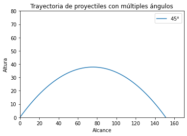
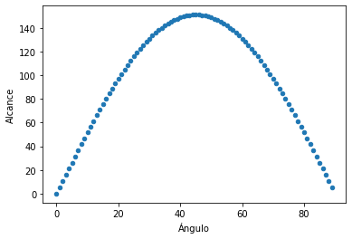
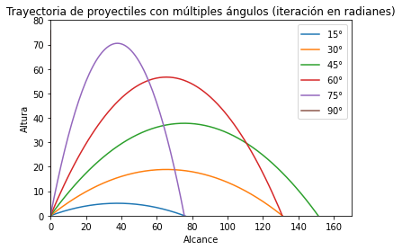

# Optimización de tiro parabólico 

[Ver proyecto en GitHub](https://github.com/SandovalAguilar/TiroParabolico)

*Sobre la busqueda de ángulos optimos para un proyectil bidimensional*

Facultad de Ciencias Físico Matemáticas

A2021 016 Física Básica

Dr. Valentín Guzmán Ramos 

Ismael Sandoval Aguilar 

19 de noviembre de 2021 


### **Introducción**

Desde la antigüedad, el estudio de la naturaleza del movimiento ha sido de gran interés para los pensadores y científicos; ya sea por motivos prácticos, como la construcción de edificaciones, o motivos meramente académicos, profundamente alimentados por la curiosidad intelectual. Pues bien, este último caso alimenta nuestra necesidad por resolver la cuestión siguiente: dadas las condiciones iniciales de un proyectil en dos dimensiones, encontrar, mediante métodos matemáticos, el ángulo en el que este alcanza su distancia horizontal máxima. Es decir: optimizar el tiro parabólico. 

Conociendo las ecuaciones que modelan el tiro parabólico, es posible derivar una expresión matemática en donde el proyectil alcance su distancia horizontal máxima. Sin embargo, dada la naturaleza empírica de este fenómeno, es necesario comprobar experimentalmente si dicho planteamiento matemático refleja totalmente lo que ocurre en la realidad; es decir, si la predicción concuerda. Para ello, plantearemos dicha ecuación y, a través de métodos numéricos desarrollados en Python, realizaremos una simulación del proyectil en la que se comprobará, _por fuerza bruta_, qué ángulo es el más óptimo. 

### **Marco teórico**

Las ecuaciones siguientes permiten modelar el movimiento de un proyectil a partir de dos suposiciones: la aceleración de caída libre es constante en el intervalo de movimiento y este se dirige hacia abajo, aunado a que el efecto de la resistencia del aire es despreciable. Con estas suposiciones, se encuentra que la trayectoria de un proyectil siempre es una parábola. De modo que, la expresión para el vector de posición del proyectil como función del tiempo es: 


$$\vec{r}_{f}=\vec{r}_{i}+\vec{v}_{i}t+\frac{1}{2}\vec{g}t^2$$

Donde las componentes de $x$ y $y$ de la velocidad inicial del proyectil son:


$$v_{xi}=v_{i}cos\theta_{i}, v_{yi}=v_{i}sen\theta_{i}$$

De lo anterior se derivan múltiples ecuaciones para calcular el tiempo de vuelo, el alcance máximo y la altura máxima. En este caso estamos particularmente interesados en conocer el alcance y la altura máxima. De modo que, para el alcance máximo: 

$$x=v_{0x}t=v_{0}cos\theta\frac{2v_{0}sen\theta}{g}=\frac{2v^{2}_{0}sen
\theta cos\theta}{g}$$

Utilizando la relación trigonométrica $sen2\theta=2sen\theta cos\theta$, resulta:

$$\therefore x_{max}=\frac{v^{2}_{0}sen2\theta}{g}$$

Por otra parte, para la altura máxima tenemos que esta se alcanza cuando 
$v_y=0$, es decir: $v_{0y}-gt=0$. Entonces:

$$t=\frac{v_{0y}}{g}=\frac{v_{0y}sen\theta}{g}$$

Sustituyendo este valor en la ecuación inicial de la posición del proyectil:

$$y=v_{0y}t-\frac{1}{2}gt^2=\frac{v^2_{0}sen^2\theta}{g}
-\frac{v^2_{0}sen^2\theta}{2g}$$

$$\therefore y_{max}=\frac{v^2_{0}sen^2\theta}{2g} \hspace{5mm} donde \hspace{5mm} g=9,80665 m/s^2$$

Dado que tratamos de buscar un ángulo $\theta$ óptimo en el que se obtenga el mayor alcance posible, consideraremos las variables siguientes:

>La variable independiente es el ángulo $\theta$, en grados. Esta será manipulada en incrementos ($\Delta \theta$) de un grado. 

Mientras que:

>La variable dependiente es la altura $x_{max}$, en metros. 

Por último:
>Las variables de control son la velocidad inicial $v_0$, la aceleración estándar debida a la gravedad $g$ y nuestra simulación.

Entonces, con ello determinaremos si es posible determinar matemáticamente el ángulo óptimo de un proyectil para alcanzar la el mayor alcance posible.


### **Hipótesis**

Para obtener el ángulo óptimo, es necesario encontrar el máximo de nuestra función $x_{max}(\theta)$  donde la distancia es mayor. Para ello calcularemos su derivada, de modo que: 

$$x_{max}=\frac{2v^{2}_{0}sen
\theta cos\theta}{g} \Rightarrow x'_{max}=\frac{2v^{2}_{0}}{g} \cdot \frac{d}{d \theta}(sen
\theta cos\theta)$$

$$\therefore x'_{max}=\frac{2v^{2}_{0}}{g}  (-sen^2 \theta + cos^2 \theta)$$

Ahora bien, sabemos que este máximo se dará a lugar cuando $x'_{max}=0$, ya que la inclinación de su pendiente será nula. Entonces:

$$x'_{max}=\frac{2v^{2}_{0}}{g}  (-sen^2 \theta + cos^2 \theta)=0 \Rightarrow -sen^2\theta+cos^2\theta=0$$

Sumando $-sen^2\theta$ en ambos lados de la ecuación:

$$cos^2\theta=sen^2\theta$$

Dividimos ambos lados por $cos^2\theta$:

$$\frac{cos^2\theta}{cos^2\theta}=\frac{sen^2\theta}{cos^2\theta} \Rightarrow \frac{sen^2\theta}{cos^2\theta}=1$$

Elevamos ambos términos al cuadrado y utilizamos la identidad trigonométrica $tan\theta$ equivalente a la expresión dentro del paréntesis:

$$\left(\frac{sen^2\theta}{cos^2\theta}\right)^2=1^2 \Rightarrow tan\theta=1$$

Ahora podemos despejar $\theta$ utilizando $arctan\theta$:

$$arctan(1)=\theta$$

$$\therefore \theta=45^\circ$$

Dado que, de acuerdo al razonamiento anterior, cuando $\theta=45^\circ$ se alcanza el mayor alcance posible con una velocidad fija. Por lo tanto, la gráfica esperada es:




Nota: para este gráfico se utilizó una velocidad incial arbitraria: $v_0=38.5m/s$


### **Metodología**

Antes de concluir el experimento, existieron algunos requerimientos: contar con una computadora, librerías de Python y Jupyter Notebook instalados y múltiples libros que utilizamos como fuentes bibliográficas. Este experimento fue realizado a partir de una simulación en Python, utilizando las librerías de de matemáticas y graficación. 

Materiales:

- Una computadora con Ubuntu 20.04.
- Python 3.8 instalado.
- Jupyter Notebook. 
- Diversas librerías (math, matplotlib, numpy, pandas).

Posteriormente, para realizar nuestra simulación escribimos un pequeño programa que itera entre el rango de ángulos previamente establecido; esto es el equivalente a lanzar un proyectil $n$ veces con las condiciones arbitrarias deseadas. Para ello, importamos las siguientes librerías: 


```python
import numpy as np
import matplotlib.pyplot as plt
import math
import pandas as pd
```

Posteriormente establecemos el valor de nuestras constantes (como la aceleración de la gravedad) y condiciones iniciales arbitrarias: 


```python
#Variables constantes y listas
v = 38.5
g = 9.80665
theta = 0
```

Junto con los arreglos que almacenarán los resultados de nuestra simulación:


```python
theta_lista = []
xmax_lista = []
resultado = 0
```

Ahora bien, es momento de crear una función que reciba como parámetros nuestra constante y condiciones iniciales, que serán evaluadas en nuestra ecuación $x_{max}$, para que posteriormente esta retorne el valor de dicha ecuación. De modo que: 


```python
def x_max(v, theta, g):
    ecuacion = (np.sin(np.deg2rad(2 * theta)) * v ** 2)/ (g) 
    return ecuacion
```

Por último, añadimos el siguiente bloque que se encargará de iterar $0^\circ<\theta<90^\circ$, que proporcionará los datos para nuestra gráfica de **alcance contra ángulo**:


```python
while theta < 90:
    resultado = x_max(v, theta, g)
    xmax_lista.append(resultado)
    theta_lista.append(theta)
    theta += 1
```

Además, el bloque anterior guardará cada ángulo, junto con su distancia correspondiente, en los arreglos previamente señalados. Ahora bien, como recurso de apoyo, utilizamos el siguiente programa para visualizar la **trayectoria** de cada proyectil:

```python
# theta=pi/3
V = 38.5 
t = np.arange(0, 100, 0.1)
angulo = math.pi / 12
angulo_lista = []

while angulo < math.pi / 2:
    x = V * np.cos(angulo) * t
    y = V * np.sin(angulo) * t + (0.5 * -9.80665 * t ** 2)
    plt.ylim(0, 80)
    plt.xlim(0, 170)
    plt.plot(x, y)
    zero_crossing_idx = np.argwhere(y > 0)[-1]
    angulo_lista.append(rf'{np.rad2deg(angulo):.0f}$\degree$')
    angulo += math.pi / 12

plt.xlabel("Alcance")
plt.ylabel("Altura")
plt.title('Trayectoria de proyectiles con múltiples ángulos')
plt.legend(angulo_lista)
plt.show()
```
                       

### **Resultados**


```python
df = pd.DataFrame({'Ángulo':theta_lista, 'Alcance':xmax_lista})
df
```


<div>
<style scoped>
    .dataframe tbody tr th:only-of-type {
        vertical-align: middle;
    }

    .dataframe tbody tr th {
        vertical-align: top;
    }

    .dataframe thead th {
        text-align: right;
    }
</style>
<table border="1" class="dataframe">
  <thead>
    <tr style="text-align: right;">
      <th></th>
      <th>Ángulo</th>
      <th>Alcance</th>
    </tr>
  </thead>
  <tbody>
    <tr>
      <th>0</th>
      <td>0</td>
      <td>0.000000</td>
    </tr>
    <tr>
      <th>1</th>
      <td>1</td>
      <td>5.274969</td>
    </tr>
    <tr>
      <th>2</th>
      <td>2</td>
      <td>10.543512</td>
    </tr>
    <tr>
      <th>3</th>
      <td>3</td>
      <td>15.799209</td>
    </tr>
    <tr>
      <th>4</th>
      <td>4</td>
      <td>21.035657</td>
    </tr>
    <tr>
      <th>...</th>
      <td>...</td>
      <td>...</td>
    </tr>
    <tr>
      <th>85</th>
      <td>85</td>
      <td>26.246477</td>
    </tr>
    <tr>
      <th>86</th>
      <td>86</td>
      <td>21.035657</td>
    </tr>
    <tr>
      <th>87</th>
      <td>87</td>
      <td>15.799209</td>
    </tr>
    <tr>
      <th>88</th>
      <td>88</td>
      <td>10.543512</td>
    </tr>
    <tr>
      <th>89</th>
      <td>89</td>
      <td>5.274969</td>
    </tr>
  </tbody>
</table>
<p>90 rows × 2 columns</p>
</div>


```python
df.plot('Ángulo', 'Alcance', kind='scatter')
```


    <AxesSubplot:xlabel='Ángulo', ylabel='Alcance'>


    

    


```python
# theta=pi/3
V = 38.5 
t = np.arange(0, 100, 0.1)
angulo = math.pi / 12
angulo_lista = []

while angulo < math.pi / 2:
    x = V * np.cos(angulo) * t
    y = V * np.sin(angulo) * t + (0.5 * -9.80665 * t ** 2)
    plt.ylim(0, 80)
    plt.xlim(0, 170)
    plt.plot(x, y)
    zero_crossing_idx = np.argwhere(y > 0)[-1]
    angulo_lista.append(rf'{np.rad2deg(angulo):.0f}$\degree$')
    angulo += math.pi / 12

plt.xlabel("Alcance")
plt.ylabel("Altura")
plt.title('Trayectoria de proyectiles con múltiples ángulos (iteración en radianes)')
plt.legend(angulo_lista)
plt.show()
```


    

    


### **Análisis**

Ahora bien, para verificar que nuestra hipótesis inicial sea correcta, vamos a buscar cuál es la posición del resultado máximo dentro de nuestro *dataframe*. La siguiente linea de código recoge el *id* de los valores máximos de cada columna (ángulo, alcance):


```python
df.idxmax(axis=0)
```


    Ángulo     89
    Alcance    45
    dtype: int64


Como se puede observar, el alcance máximo corresponde a la fila #45, misma que corresponde a $\theta=45^\circ$. Al ejecutar la siguiente línea de código, podemos obtener el **valor** que corresponde a dicha posición:


```python
df.max(axis=0)
```


    Ángulo      89.000000
    Alcance    151.147436
    dtype: float64


Es decir, cuando:

 $$\theta=45^\circ \rightarrow x_{max}=151.147$$

El cual es el valor máximo obtenido de nuestra simulación.


### **Conclusión**

Por lo tanto, nuestra hipótesis inicial

$$x'_{max}=\frac{2v^{2}_{0}}{g}(-sen^2 \theta + cos^2 \theta) \hspace{5mm} \rightarrow \hspace{5mm} \theta=45^\circ$$

Es correcta para todo ángulo $\theta$; es posible derivar una expresión matemática en donde el proyectil alcance su distancia horizontal máxima.


### **Bibliografía**

- Serway, R. A., Jewett, J. W., &amp; Peroomian Vahé. (2019). Physics for scientists and engineers (7th ed., Vol. 1). Cengage. 
- Brandon Leonard. (2021, June 21). Python in the modeling of Projectile Motion. Assignment Help Blog. Retrieved November 19, 2021, from https://www.assignmentexpert.com/blog/modeling-projectile-motion-using-python/. 
